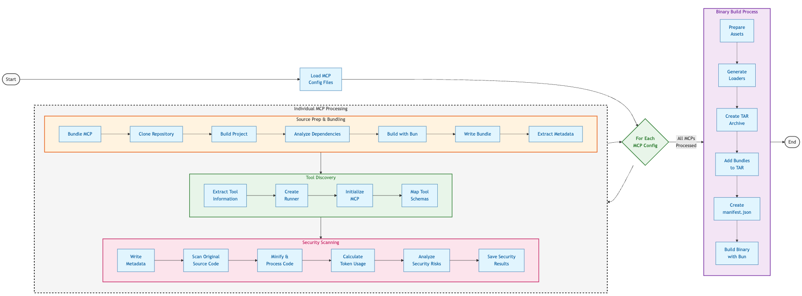

# MCP Bundling Process

This document explains the MCP bundling process that packages third-party MCP servers into deployable executables.

## Overview

The bundling process transforms YAML configuration files into bundled MCPs by:

1. Cloning the source repositories
2. Building the projects
3. Bundling dependencies with security controls
4. Discovering tools
5. Performing security analysis
6. Applying sandbox mechanisms
7. Creating documentation

## Process Flow Diagram



## Process Explanation

### 1. Configuration

- **Config Files**: YAML files in the `./bundled` directory define MCP servers
- **Directory Setup**: Creates config directory if missing, cleans output directory
- **Command Options**: Supports paths, verbosity, and security scanning options

### 2. Configuration Format

- **Config Structure**:
  - `name`: MCP name (defaults to file/directory name)
  - `description`: Optional description
  - `source`: Repository URL and reference
  - `build`: Build options and command line arguments
  - `security`: Security settings (exists in schema but not enforced)
  - `staticFiles`: Additional files to include
  - `envVars`: Environment variables with mock values for testing

- **Loading Process**:
  - Finds YAML files in the configured directory
  - Validates required fields and formats
  - Applies defaults for optional values

### 3. Source Preparation

- **Git Operations**:
  - Clones the repository to a temporary directory
  - Checks out the specified branch or tag

- **Build Process**:
  - Installs dependencies with `bun install`
  - Tries build scripts in order: `prepublish`, `build`, `compile`
  - Falls back to TypeScript compilation if needed

### 4. Dependency Analysis

- **Package Analysis**: Extracts dependencies from `package.json` and determines module format (ESM/CommonJS)
- **Entry Point Detection**: Finds entry point via package.json fields or common patterns
- **Import Analysis**: Scans code for ESM imports and CommonJS requires to build dependency list

### 5. Bundling Process

- **Configuration**: Sets up bundle options based on detected module format
- **Bundle Creation**: Uses Bun's build API with fallbacks for failed builds
- **Resource Handling**: Copies static files and maintains directory structure
- **Metadata**: Extracts project information including name, version, and dependencies

### 6. Tool Discovery

- **Subprocess Creation**: Runs bundled MCP with environment variables and security settings
- **JSON-RPC Communication**: Communicates over stdio to initialize the MCP and query tools
- **Tool Registration**: Maps discovered tools with names, descriptions, and schemas

### 7. Security Scanning

When enabled, security scanning performs comprehensive analysis:

- **Source Code Collection**: Processes original source files, filtering out tests and non-essential code
- **Token Optimization**: Minifies code while preserving security-relevant comments and content
- **Claude 3.7 Integration**: Uses AWS Bedrock to analyze code for security issues
- **Risk Categories**: Analyzes 10 security categories including injection vulnerabilities, access control issues, and data handling
- **Results Processing**: Provides risk scores, findings, and recommendations in JSON format

### 8. Sandbox Security Mechanism

The QNSC MCP Toolkit implements a multi-layer defense-in-depth security strategy to protect users from potentially malicious code in external MCP servers. This sandbox mechanism operates at multiple levels throughout the bundling and execution process.

#### Build-Time Security Layers

**Code Injection - Filesystem Security** ([fs-security-plugin.ts](../../../../src/gateway/bundler/plugins/fs-security-plugin.ts)):

- Intercepts all `fs` and `fs/promises` module imports during bundling
- Replaces them with security shim templates ([fs-security.js.tmpl](../../../../src/gateway/bundler/templates/fs-security.js.tmpl))
- Security options:
  - Block all filesystem access (default)
  - Allow specific paths only via whitelist
  - Supports path magic words: `CWD`, `TEMP`, `HOME`, `{{CWD}}`, `{{TEMP}}`, `{{HOME}}`
- All filesystem operations check paths against the allowlist before execution
- Unauthorized access attempts throw descriptive errors

**Code Injection - Network Security** ([network-security-plugin.ts](../src/gateway/bundler/plugins/network-security-plugin.ts)):

- Intercepts network-related module imports: `http`, `https`, `net`, `dns`, `dgram`, `tls`
- Overrides the global `fetch` API via injected shim code
- Security options:
  - Block all network access (default)
  - Allow specific domains via allowlist (supports domain and subdomain matching)
- Shim templates enforce security policies at the API level
- Network requests to non-allowlisted domains are rejected with descriptive errors

#### Runtime Security Layers

**Process Isolation** ([bun-subprocess-runner.ts](../src/gateway/sandbox/bun-subprocess-runner.ts)):

- Executes bundled MCPs in completely separate subprocesses using `spawn()`
- Key isolation features:
  - Separate process memory space (full memory isolation)
  - Controlled STDIO communication via JSON-RPC protocol only
  - Cannot access parent process memory or state
  - Can be terminated at any time with timeouts
  - Configurable RPC timeout (default: 60 seconds)

**Environment Variable Filtering** ([env-filter.ts](../src/gateway/utils/env-filter.ts)):

- Strictly controls which environment variables are passed to subprocess
- Default safe system variables whitelist:
  - Path-related: `PATH`, `PATHEXT`
  - Terminal: `TERM`, `TERM_PROGRAM`
  - Locale: `LANG`, `LC_ALL`
  - User/home: `HOME`, `USER`, `USERPROFILE`
  - Temp directories: `TEMP`, `TMP`, `TMPDIR`
  - Time zone: `TZ`
- Only explicitly declared environment variables from MCP metadata are passed
- Sensitive credentials never passed unless explicitly configured
- Supports default values and required variable validation

**JSON-RPC Protocol Enforcement** ([bun-subprocess-runner.ts](../src/gateway/sandbox/bun-subprocess-runner.ts)):

- All communication happens through validated JSON-RPC messages
- MCP can only respond to specific methods:
  - `initialize` - Server initialization handshake
  - `tools/list` - Enumerate available tools
  - `tools/call` - Execute a specific tool
- Request/response validation ensures protocol compliance
- Timeouts prevent hanging processes
- Pending requests tracked and cleaned up on process exit

**Remote MCP Isolation** ([remote-mcp-client.ts](../src/gateway/remote-mcp-client.ts)):

- Remote HTTP-based MCPs use network-level isolation
- Communication via HTTP streaming transport only
- No direct code execution in the main process
- Server name validation prevents impersonation
- OAuth challenge handling for authentication
- Connection status tracking and error handling

#### Security Configuration

Sandbox security can be configured through YAML configuration files in the `./bundled` directory:

```yaml
name: example-mcp
source:
  repository: https://github.com/example/mcp-server
  ref: main
security:
  allowFileSystem: false # Block all filesystem access
  allowedPaths: # Or whitelist specific paths
    - '{{CWD}}/data'
    - '{{TEMP}}'
  allowNetwork: false # Block all network access
  networkAllowlist: # Or allow specific domains
    - 'api.example.com'
    - 'example.com'
envVars:
  - name: API_KEY
    required: true
    description: API key for service
```

User configuration in `.qnscmcp.yaml` controls which MCPs are loaded:

```yaml
tools:
  includeMCPs: ['figma', 'confluence'] # Bundled MCPs
  includeRemoteMCPs: ['trusted-server'] # Remote HTTP MCPs
```

#### Defense-in-Depth Summary

The sandbox protects users through multiple complementary layers:

1. **Static Analysis** - AI-powered security scanning before execution (see section 7)
2. **Code Rewriting** - Dangerous APIs replaced with security shims at bundle time
3. **Process Isolation** - Separate subprocess with controlled communication channel
4. **Resource Control** - Filesystem and network access blocked or restricted by default
5. **Environment Isolation** - Only safe and explicitly declared environment variables exposed
6. **Protocol Enforcement** - Strict JSON-RPC communication prevents arbitrary code execution

This multi-layer approach ensures that even if one layer is bypassed, additional security controls remain in place to protect the user's system.

### 9. Output Generation

- **File Generation**: Creates output directory with bundled MCPs and metadata files
- **Documentation**: Generates README files with:
  - MCP information and version details
  - Security scan results and risk assessments
  - Environment variable documentation
  - Tool listings and descriptions
- **Summary Report**: Shows bundle status, security scores, and execution time

### 10. Binary Building Process

- **Asset Preparation**: Patches dependencies and generates loaders for the build
- **TAR Archive**: Creates a portable archive (`mcps.tar`) containing all bundled MCPs
- **Manifest**: Generates a JSON manifest with version info and MCP inventory
- **Binary Creation**: Uses Bun's build API to create the executable with embedded assets

## Key Components

- **MCPBatchBundler**: Coordinates overall bundling process, handles configurations and workflow

- **MCPBundler**: Bundles individual MCPs, builds projects, and creates optimized bundles

- **RepoCloner**: Manages Git operations for source repositories

- **DependencyAnalyzer**: Extracts dependencies and determines module formats

- **BunSubprocessRunner**: Executes MCPs in secure sandbox with JSON-RPC communication

- **MCPSecurityScanner**: Analyzes code for security risks using Claude 3.7 Sonnet

- **MCPTarBundler**: Creates portable archive files for binary embedding

- **MCPExtractor**: Manages extraction of MCPs to cache directories

## Configuration Options

### Environment Variables

- `SECURITY_SCAN`: Enables/disables security scanning (default: true)
- `NO_SECURITY_SCAN`: Disables security scanning when set
- `BEDROCK_INFERENCE_PROFILE_ID`: AWS Bedrock profile for security scanning
- `AWS_REGION`: AWS region for Bedrock API calls (default: us-east-1)

### Command Line Options

- `--config-dir`: Directory with MCP configuration files
- `--output-dir`: Output directory for bundled MCPs
- `--verbose`: Enable detailed logging
- `--security-scan`: Override security scanning setting
- `--inference-profile`: Set AWS Bedrock profile ID

## Summary

The MCP bundling process packages third-party MCP servers into executable bundles with comprehensive metadata and security information. These bundled MCPs are executed in a secure sandbox environment with multiple layers of protection:

- **Build-time security**: Filesystem and network APIs are replaced with security shims during bundling
- **Runtime isolation**: MCPs execute in separate subprocesses with restricted environment variables
- **Protocol enforcement**: Communication limited to JSON-RPC protocol only
- **Static analysis**: AI-powered security scanning identifies potential risks before deployment

This defense-in-depth approach ensures that external MCP servers can provide functionality while being prevented from accessing unauthorized filesystem paths, making arbitrary network requests, or accessing sensitive environment variables without explicit permission.
