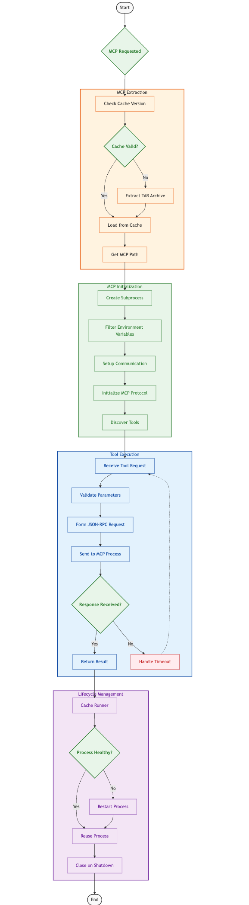

# MCP Execution Process

This document explains how bundled MCPs are executed in the QNSC MCP Toolkit. The process extracts MCPs from the embedded archive, runs them in separate processes, and communicates with them using the Model Context Protocol.

## Overview

The execution process has four main phases:
1. **Extraction** - Getting MCPs from the bundled archive
2. **Initialization** - Setting up the runtime environment
3. **Tool discovery and execution** - Finding and running MCP tools
4. **Lifecycle management** - Handling processes and resources

## Process Flow Diagram

## Detailed Process Explanation

### 1. MCP Extraction

The `MCPExtractor` class handles extracting bundled MCPs from the embedded tar archive:

1. **Cache Management**:
   - Creates a cache directory at `~/.config/mcptools/bundled` (configurable)
   - Tracks MCP versions with a `version.json` file
   - Resets the cache when versions don't match

2. **Extraction Process**:
   - Reads the embedded `mcps.tar` archive
   - Extracts all MCP directories to the cache location
   - Preserves the directory structure for each MCP

3. **MCP Discovery**:
   - Lists available MCPs from the manifest
   - Validates MCPs by checking for metadata files
   - Provides paths to extracted MCPs

4. **Development Support**:
   - Supports both production and development modes
   - Falls back to local directories when needed

### 2. MCP Initialization and Environment Setup

The `BunSubprocessRunner` class provides the execution environment for MCPs:

1. **Subprocess Creation**:
   - Creates a child process for each MCP
   - Resolves the execution path from the cache
   - Sets up the correct working directory for relative imports

2. **Environment Variables**:
   - Only passes safe system variables (PATH, HOME, USER, etc.)
   - Applies MCP-specific environment variables from metadata
   - Filters out sensitive or unnecessary variables

3. **Runtime Handling**:
   - Uses Bun as the primary runtime
   - Falls back to Node.js if Bun is unavailable
   - Sets up stdin/stdout pipes for communication

4. **MCP Protocol Initialization**:
   - Sends an `initialize` request with protocol version and capabilities
   - Extracts server info and supported features
   - Discovers available tools

### 3. Tool Discovery and Execution

The `BundledMCPManager` and `SandboxProvider` classes handle tool discovery, registration, and execution:

1. **Tool Discovery**:
   - Reads tools from MCP metadata files
   - Sends a `tools/list` request to each MCP
   - Caches discovered tools for performance

2. **Tool Registration**:
   - Creates unique tool IDs with format `mcpName__toolName`
   - Builds handlers that route requests to the appropriate MCP
   - Converts JSON schemas to Zod schemas for validation
   - Registers tools with the main registry

3. **Tool Execution**:
   - Validates parameters against schemas
   - Gets or creates a runner for the MCP
   - Sends a `tools/call` request with arguments
   - Returns results or propagates errors
   - Handles both `arguments` and `params` formats

4. **Tool Configuration**:
   - Controls which tools are available via configuration
   - Tools are disabled by default until explicitly enabled

### 4. Error Handling and Lifecycle Management

The MCP execution system implements robust error handling and lifecycle management to ensure reliability and resource efficiency:

1. **Comprehensive Error Handling**:
   - **Request Timeouts**: All JSON-RPC requests have configurable timeouts (default 30s) to prevent hanging
   - **Format Compatibility**: Tries both `arguments` and `params` formats for tool calls to handle different MCP implementations
   - **Process Monitoring**: Monitors the MCP process for crashes and unexpected exits
   - **Response Validation**: Validates JSON-RPC responses and handles malformed responses gracefully
   - **Error Propagation**: Properly propagates errors from the MCP process back to callers with meaningful context
   - **Parsing Errors**: Handles JSON parsing errors in process output with appropriate warnings
   - **Tool-level Error Handling**: Each tool handler has custom error handling to ensure tool failures don't affect the system

2. **Process Lifecycle Management**:
   - **Event Handling**: Sets up event listeners for process exit, error, and data events
   - **Exit Handling**: Properly handles process exit with error propagation to pending requests
   - **Signal Handling**: Sends proper termination signals when shutting down processes
   - **Resource Cleanup**: Ensures pipes and file descriptors are properly closed
   - **Error Event Handling**: Responds to process error events by cleaning up resources

3. **Runner Caching and Reuse**:
   - **Active Runner Cache**: `SandboxProvider` maintains a Map of active runners keyed by bundle path
   - **Lazy Initialization**: Runners are only created when needed and reused for subsequent requests
   - **Shared Resources**: Multiple tool calls to the same MCP reuse the same process
   - **Tool Caching**: `BunSubprocessRunner` caches tool information to avoid repeated discovery
   - **Efficiency**: This approach minimizes process creation overhead and resource usage

4. **Request Management**:
   - **Request Tracking**: Maintains a Map of pending requests with unique UUIDs
   - **Timeout Management**: Sets up timeouts for each request to prevent resource leaks
   - **Request Correlation**: Correlates JSON-RPC responses with pending requests using request IDs
   - **Request Cleanup**: Clears timeouts and removes requests from the pending map when complete
   - **Batch Processing**: Handles multiple responses in a single data event for efficiency

5. **Subprocess Health Management**:
   - **Runtime Selection**: Tries Bun first, with automatic fallback to Node.js
   - **Working Directory**: Carefully sets up the correct working directory structure
   - **Environment Variables**: Ensures required environment variables are available
   - **Stdout Handling**: Processes stdout data in chunks with line-by-line parsing
   - **Stderr Redirection**: Redirects stderr to the parent process for debugging
   - **Process Resurrection**: Automatically creates new processes when needed

## Key Components

### MCPExtractor

Handles the extraction of bundled MCPs from the embedded tar archive:
- Creates and manages the cache directory
- Extracts the tar archive to the cache
- Provides methods to check MCP availability and location
- Handles cache versioning and invalidation

### BundledMCPManager

Manages the discovery, registration, and execution of bundled MCPs:
- Discovers MCPs in the cache directory
- Reads metadata and registers tools with the registry
- Creates handlers for tool execution
- Manages MCP lifecycle and resources

### BunSubprocessRunner

Executes bundled MCPs in separate processes:
- Creates subprocesses with proper environment setup
- Implements JSON-RPC communication over stdin/stdout
- Handles process events and errors
- Manages request timeouts and retries

### SandboxProvider

Provides a controlled execution environment:
- Manages the execution of tools in bundled MCPs
- Caches runners for efficiency
- Handles tool initialization and execution
- Implements error handling and recovery mechanisms

## Environment Variables

The MCP execution process can be influenced by various environment variables:

- `MCP_CACHE_DIR`: Override the default cache directory location
- `MCP_DISABLE_CACHE`: Disable caching and extract MCPs on each run
- `MCP_VERBOSE`: Enable verbose logging for debugging
- Custom environment variables specific to individual MCPs as defined in their metadata

## Summary

The MCP execution process provides a robust mechanism for running bundled MCPs in controlled subprocesses. It includes sophisticated extraction, initialization, communication, and lifecycle management features that ensure reliable and efficient operation of third-party MCP tools.

The bundled MCPs are extracted from the embedded tar archive to a cache directory, initialized with proper environment variables and working directories, and communicated with using JSON-RPC over stdin/stdout. The system efficiently manages resources by reusing runners when possible and properly cleaning up processes when they're no longer needed.