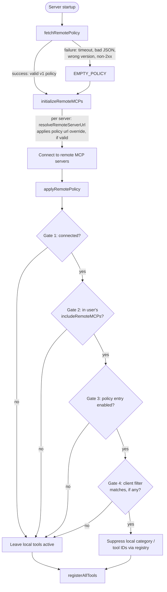

# Remote Routing Policy

This document describes the remote routing policy mechanism that lets a centralized, out-of-band config decide — per remote MCP server, without an mcp-tools code change or release — whether to prefer that server's remote implementation over its local tool equivalent.

## Overview

QNSC MCP Toolkit ships many capabilities as both a local tool implementation and a remote MCP server. The remote routing policy is the mechanism used to migrate traffic from local to remote server-by-server: it fetches a small JSON document from a CloudFront/S3-backed endpoint at startup and uses it to decide, per remote server:

- Whether that server's local tool category (or specific tool IDs) should be suppressed in favor of the remote server.
- Which client(s) the suppression should apply to, if a rollout should be limited to specific MCP clients.
- Optionally, which URL the remote server itself should connect to — allowing a server to be redirected to a different gateway/cluster without a release.

It's designed to be **fail-safe**: if the policy endpoint is unreachable, slow, or returns something unexpected, nothing changes — every local tool stays active and every remote server falls back to its compiled-in default URL.

## Architecture

### Startup sequence



The policy is fetched **once**, before remote MCP servers are connected, so the same `RemotePolicy` object can drive both steps below without a second network call:

1. **Host resolution** — `resolveRemoteServerUrl()` is applied per server inside `initializeRemoteMCPs` (`src/commands/remote-mcp.ts`), so a policy-driven `url` override can redirect a server's connection before it connects.
2. **Local tool suppression** — `applyRemotePolicy()` runs after remote servers have connected (so real connection status is known) and before `registerAllTools()` applies `excludeCategories`/`exclude` (so the suppression actually takes effect).

This ordering is implemented in `startServer()` in [`server.ts`](https://github.com/quynhonsemiconductor/mcp-tools/blob/main/src/commands/server.ts).

### Fail-safe fetch

`fetchRemotePolicy()` in [`remote-policy.ts`](https://github.com/quynhonsemiconductor/mcp-tools/blob/main/src/gateway/remote-policy.ts) resolves the policy URL from the build's environment tier (`prod` / `pre-prod` / `non-prod`, via `getEnvironmentTier()`) and fetches it with a 2-second timeout. Any of the following degrade to `EMPTY_POLICY` (an empty `policies` map) rather than throwing:

- No policy host mapped for the resolved tier
- Non-2xx response
- Request timeout (`AbortError`)
- Invalid JSON (`SyntaxError`)
- Network error (`TypeError`)
- Response missing `version`/`policies`, or an unsupported schema `version`

With `EMPTY_POLICY`, every local tool stays on and every remote server uses its compiled-in default URL — the same behavior as if the policy mechanism didn't exist at all.

## Policy schema

```json
{
  "version": 1,
  "policies": {
    "some-remote-server-id": {
      "enabled": true,
      "suppressLocalCategories": ["SomeCategory"],
      "suppressLocalTools": ["someSpecificLocalToolId"],
      "clients": ["claude-code", "vscode"],
      "url": "https://some-service.mcp.qnsc.vn"
    }
  }
}
```

Each key under `policies` is a remote server's `id` (matching `AVAILABLE_REMOTE_MCP_SERVERS` in `src/remote-mcps/available-remote-servers.ts`). Fields on each entry:

- **enabled** (required) — master switch for this server's entry. Everything else is ignored when `false`.
- **suppressLocalCategories** (optional) — whole local tool categories to exclude once this server's gates all pass.
- **suppressLocalTools** (optional) — individual local tool IDs to exclude, for suppressing a single tool without splitting it out of a shared local category. Must be exact tool IDs — glob metacharacters (`* ? [ ] { } !`) are rejected and logged, since `suppressLocalTools` flows into `config.tools.exclude`, which treats entries as minimatch patterns (a stray `*` would suppress unrelated local tools).
- **clients** (optional) — if present and non-empty, suppression only applies when the connecting client's name matches one of these (case-insensitive). Omitted or empty means "all clients."
- **url** (optional) — a connection URL override for this remote server. Only applied when `enabled` is true, the URL passes `isValidPolicyUrl` (must be `https://` and end in an allowed domain suffix — currently `qnsc.vn`), and no local `{SERVICE}_MCP_URL` environment variable is set for that server (an env var always wins over the policy).

A malformed entry (wrong types, non-array `clients`, etc.) is skipped with a warning — it does not abort processing of the other entries.

## The four suppression gates

`applyRemotePolicy()` only suppresses local tools for a server once **all** of the following are true:

1. **Connected** — the remote server actually connected successfully this run (checked via `RemoteMCPManager.getConnectionStatus()`).
2. **Opted in** — the server ID is present in the user's own `includeRemoteMCPs` config. A policy can't turn on a remote server the user hasn't enabled.
3. **Enabled** — the policy entry's `enabled` flag is `true`.
4. **Client filter** — if the entry has a `clients` list, the current client's name (from telemetry's MCP handshake capture) must match one of them.

Any failed gate leaves that server's local tools untouched and logs why at `debug` level.

## Known limitation: client filter at startup

The `clients` gate depends on the connecting client's identity, which telemetry only captures once the MCP handshake completes. `applyRemotePolicy()` currently runs once, during startup, **before** that handshake — so a policy entry with a `clients` filter will not apply on that run if the client name isn't yet available. This is a tracked follow-up (see the `TODO: Post-handshake re-evaluation` comment in `server.ts`), not a bug: policies without a `clients` filter are unaffected, and the fail-safe default (leave local tools active) is preserved in the meantime.

## Testing

Tests are in `src/gateway/remote-policy.test.ts`, `src/gateway/remote-mcp-manager.test.ts`, and `src/gateway/remote-mcp-client.test.ts`. Run with:

```bash
bun test src/gateway/remote-policy.test.ts
```

## Troubleshooting

### A remote server isn't taking over from its local tool

Check the startup logs for `[remote-policy]` lines, in gate order:

1. `no such remote MCP server configured` / `not connected (status: ...)` — Gate 1 failed; the server didn't connect.
2. `not in includeRemoteMCPs` — Gate 2 failed; add the server ID to `includeRemoteMCPs` in `.qnscmcp.yaml`.
3. `policy entry disabled` — Gate 3 failed; the policy document has `enabled: false` for this server.
4. `not in client filter` — Gate 4 failed; the connecting client isn't in the entry's `clients` list, or the client name wasn't available yet at startup (see [Known limitation](#known-limitation-client-filter-at-startup)).

### A policy `url` override isn't being applied

- Confirm no local `{SERVICE}_MCP_URL` environment variable is set for that server — it always takes precedence over the policy.
- Confirm the URL is `https://` and ends in an allowed domain suffix; check logs for `policy url "..." failed validation`.

### Policy changes aren't showing up at all

- The policy is fetched once per server startup with a 2-second timeout; restart the server to pick up a change.
- Check for `[remote-policy] Policy fetch...` / `Invalid policy format` / `Unsupported policy version` warnings, any of which fall back to `EMPTY_POLICY` (no suppression, no URL overrides).
